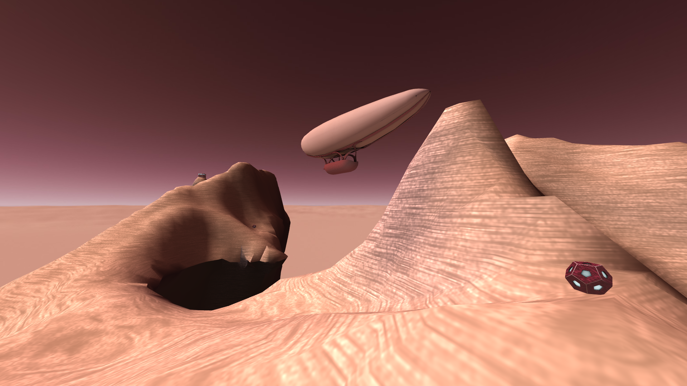

#  **IMAC-Lihowar** :ringed_planet::sunrise_over_mountains:
![Ça c'est IMAC](https://img.shields.io/badge/%C3%87a_c'est_IMAC-2022-0.svg?labelColor=252525&color=25afdf&logo=data:image/png;base64,iVBORw0KGgoAAAANSUhEUgAAAA4AAAAMCAYAAABSgIzaAAAACXBIWXMAAAWJAAAFiQFtaJ36AAAF+mlUWHRYTUw6Y29tLmFkb2JlLnhtcAAAAAAAPD94cGFja2V0IGJlZ2luPSLvu78iIGlkPSJXNU0wTXBDZWhpSHpyZVN6TlRjemtjOWQiPz4gPHg6eG1wbWV0YSB4bWxuczp4PSJhZG9iZTpuczptZXRhLyIgeDp4bXB0az0iQWRvYmUgWE1QIENvcmUgNS42LWMxNDUgNzkuMTYzNDk5LCAyMDE4LzA4LzEzLTE2OjQwOjIyICAgICAgICAiPiA8cmRmOlJERiB4bWxuczpyZGY9Imh0dHA6Ly93d3cudzMub3JnLzE5OTkvMDIvMjItcmRmLXN5bnRheC1ucyMiPiA8cmRmOkRlc2NyaXB0aW9uIHJkZjphYm91dD0iIiB4bWxuczp4bXA9Imh0dHA6Ly9ucy5hZG9iZS5jb20veGFwLzEuMC8iIHhtbG5zOmRjPSJodHRwOi8vcHVybC5vcmcvZGMvZWxlbWVudHMvMS4xLyIgeG1sbnM6cGhvdG9zaG9wPSJodHRwOi8vbnMuYWRvYmUuY29tL3Bob3Rvc2hvcC8xLjAvIiB4bWxuczp4bXBNTT0iaHR0cDovL25zLmFkb2JlLmNvbS94YXAvMS4wL21tLyIgeG1sbnM6c3RFdnQ9Imh0dHA6Ly9ucy5hZG9iZS5jb20veGFwLzEuMC9zVHlwZS9SZXNvdXJjZUV2ZW50IyIgeG1wOkNyZWF0b3JUb29sPSJBZG9iZSBQaG90b3Nob3AgQ0MgMjAxOSAoV2luZG93cykiIHhtcDpDcmVhdGVEYXRlPSIyMDE5LTEyLTI2VDEyOjE2OjMyKzAxOjAwIiB4bXA6TW9kaWZ5RGF0ZT0iMjAyMC0wNC0wN1QxOTo1NjoyNyswMjowMCIgeG1wOk1ldGFkYXRhRGF0ZT0iMjAyMC0wNC0wN1QxOTo1NjoyNyswMjowMCIgZGM6Zm9ybWF0PSJpbWFnZS9wbmciIHBob3Rvc2hvcDpDb2xvck1vZGU9IjMiIHBob3Rvc2hvcDpJQ0NQcm9maWxlPSJzUkdCIElFQzYxOTY2LTIuMSIgeG1wTU06SW5zdGFuY2VJRD0ieG1wLmlpZDpiODkxODljMC0yYWZmLTc0NDUtOWViNC03NmU3YjBiNGNkZDQiIHhtcE1NOkRvY3VtZW50SUQ9ImFkb2JlOmRvY2lkOnBob3Rvc2hvcDphMDdhOTk3NS0wN2EyLWExNGUtODE1OC0zYmViYjRkYzliYjkiIHhtcE1NOk9yaWdpbmFsRG9jdW1lbnRJRD0ieG1wLmRpZDo0ZDY4NzIxYS05MzIyLTZiNDItYWI3MC00NDQ0NDY0OWIyZDEiPiA8eG1wTU06SGlzdG9yeT4gPHJkZjpTZXE+IDxyZGY6bGkgc3RFdnQ6YWN0aW9uPSJjcmVhdGVkIiBzdEV2dDppbnN0YW5jZUlEPSJ4bXAuaWlkOjRkNjg3MjFhLTkzMjItNmI0Mi1hYjcwLTQ0NDQ0NjQ5YjJkMSIgc3RFdnQ6d2hlbj0iMjAxOS0xMi0yNlQxMjoxNjozMiswMTowMCIgc3RFdnQ6c29mdHdhcmVBZ2VudD0iQWRvYmUgUGhvdG9zaG9wIENDIDIwMTkgKFdpbmRvd3MpIi8+IDxyZGY6bGkgc3RFdnQ6YWN0aW9uPSJzYXZlZCIgc3RFdnQ6aW5zdGFuY2VJRD0ieG1wLmlpZDpiODkxODljMC0yYWZmLTc0NDUtOWViNC03NmU3YjBiNGNkZDQiIHN0RXZ0OndoZW49IjIwMjAtMDQtMDdUMTk6NTY6MjcrMDI6MDAiIHN0RXZ0OnNvZnR3YXJlQWdlbnQ9IkFkb2JlIFBob3Rvc2hvcCBDQyAyMDE5IChXaW5kb3dzKSIgc3RFdnQ6Y2hhbmdlZD0iLyIvPiA8L3JkZjpTZXE+IDwveG1wTU06SGlzdG9yeT4gPC9yZGY6RGVzY3JpcHRpb24+IDwvcmRmOlJERj4gPC94OnhtcG1ldGE+IDw/eHBhY2tldCBlbmQ9InIiPz5nnotDAAABZElEQVQokW2STSiEURSGn2sm2ShFlBSjjPxlJyYsRE0mPwtqlI2NUSyMEinCxo5REnaiRkQpMjXFgg1KU6SEFUpmZWUijoW+45s4devp3Pue93Z6ERFEhJq2ZbE4HnQrdxzPKduPERE87SsCUFfmYvhtAKu81Y24cosA2KodNNjKiAgAnvYV2XGEAHDmf5I1e2MAOk9CkvkeAWCpIaLiFAs270M6bTtwpGx3Wov1SpLjY0WpNgLlEyraD/tV1LA7JQCpKV9EWqaMiQfdMaAyEXWQd3ltAHxdG9I6Wf8zqDg3SdzjegJYdSaijhhQmdb0qU7nBRncR58tofaLiDO//2FbjjH61ezRA334MuNVt8DugL5ZblswP8sRMQCvc4Xc5vT/EfUdesWk36kIbFv1+cPqdLE3pDxxtp7kZLEREXxdG7+XV9MAON2wODKmA6arupMCoBFq9oc1Wg/lJcrjp2v/Ru4bAbHApDi/6xMAAAAASUVORK5CYII=)

Contemplative adventure game. Explore the skies of a telluric satellite named Lihowar orbiting around a gaseous giant planet.

A short C++ project made for programming courses. :mortar_board:

## **Preview** :rocket::framed_picture:



## **Instructions** :wrench::gear:

### System requirements

- Tested on Linux Debian based distribution
- Hardware acceleration for OpenGL. Basic virtual machines might run very slowly

### Dependencies

The build requires **g++**, **CMake 3.10+**, **SDL2**, **OpenGL**, **GLEW** and **Doxygen**.

```sh
sudo apt install g++ cmake \
libsdl2-dev \
libglu1-mesa-dev mesa-common-dev mesa-utils \
libglew-dev freeglut3-dev \
doxygen
```

### Clone, build and run

```
git clone https://github.com/ludchieng/IMAC-Lihowar
cd IMAC-Lihowar/
mkdir build
cd build
cmake ..
make
cd bin
./lihowar config/fullscreen.json
```

You are able to edit or add config files that match your preferences. (e.g. you want to disable MSAA because of low performance)

### Generating the documentation (Doxygen)

(comming soon)

```
cd build
make doc
cd lihowarlib/doc/doc/html/
```

## **Gameplay** :video_game::game_die:

### **Rules**

Explore the islands and light on all the beacons

**Controls**:

Keyboard: \
`Z` `Q` `S` `D` or `↑` `←` `↓` `→`: move (qwerty is not supported yet) \
`A` `E`: yaw \
`LSHIFT`: move up \
`LCTRL`: move down

Joystick: (tested on Logitech Attack 3) \
`Pitch axis`: move forwards \
`Roll axis`: move sidewards \
`Throttle axis` or `3` `2`: move upwards \
`4` `5`: yaw

## License

This software is licensed under OSEF License which means IN ACCORDANCE WITH THE LICENSE OF THE
DEPENDENCIES OF THE SOFTWARE, you can use it as you want for any purpose, but it comes with no
guarantee of any kind, provided that you respects the license of the software dependencies of the
piece of code you want to reuse.

Dependencies:
* glm ([the Happy Bunny License (Modified MIT) or the MIT License](http://glm.g-truc.net/copying.txt))
* tiny_obj_loader ([MIT License](https://github.com/tinyobjloader/tinyobjloader/blob/master/LICENSE))
* stb ([public domain](https://github.com/nothings/stb))
* taocpp-json ([MIT License and additionnal from dependencies](https://github.com/taocpp/json))
* glimac (unknown but might be ok though)
